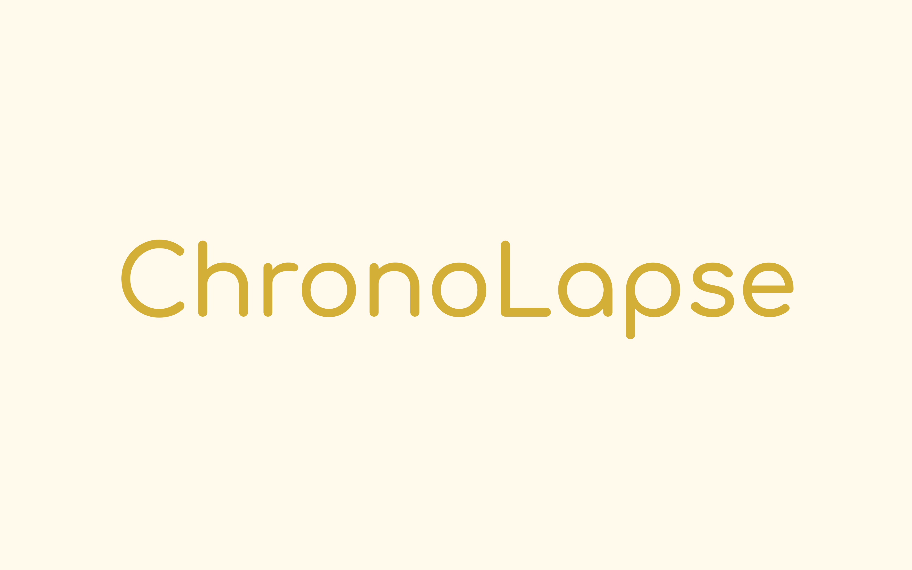
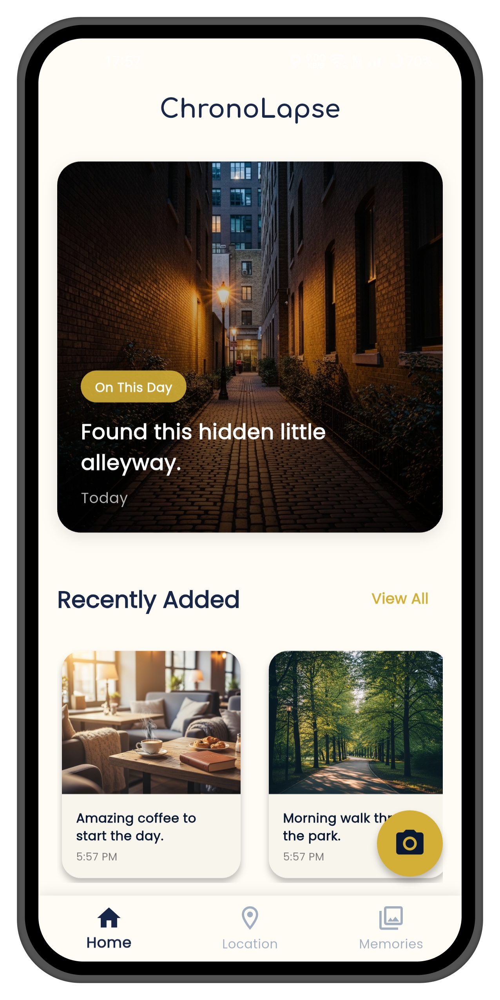
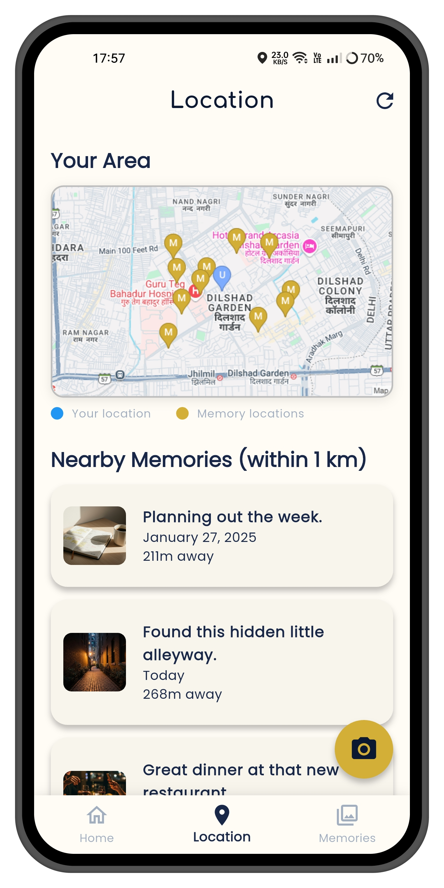
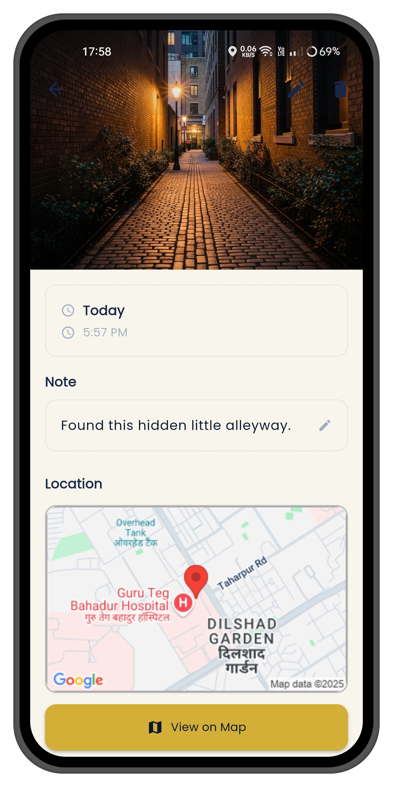

#  ChronoLapse: A Geo-Aware Personal Memory App 📸📍

 

**ChronoLapse is a fully-featured Flutter application designed to solve the "digital shoebox" problem, where photos lose their emotional context over time. It transforms a standard photo gallery into a living map of your personal history, creating moments of serendipitous delight.**

---

### ✨ Key Features

- **📍 Geo-Aware Memories:** Automatically save the precise time, date, and location with every photo and note.
- **🗺️ Interactive Memory Map:** Visualize your entire life's journey with all memories pinned on a live map.
- **⏰ "On This Day" Engine:** A dynamic home screen that surfaces relevant past memories, creating a daily reason to engage.
- **🔔 Background Notifications:** Receive delightful, serendipitous notifications when you physically revisit a location where a memory was made.
- **🖼️ Fullscreen Immersive Viewer:** View your memories in a beautiful, gesture-driven fullscreen mode.

---

### 🛠️ Tech Stack & Skills

- **Platform:** Flutter
- **UI/UX Design:** Wireframing, User Flow Mapping, Visual Identity
- **Development Process:** Directed using **Generative AI** (with meticulous prompt engineering and bug triage)
- **APIs:** Google Static Maps API

---

### 🚀 My Role as Product Manager

As the sole PM, I owned the entire product lifecycle from concept to shippable MVP. My key responsibilities included:
- **Defining the product vision** and strategy.
- **Designing the end-to-end user experience** and visual brand identity.
- **Writing detailed technical specifications** and feature requirements.
- **Managing the iterative development loop** and performing all Quality Assurance.

---

### Screenshots

| Home Screen | Location Tab | Memory Detail |
|---|---|---|
|  |  |  |
